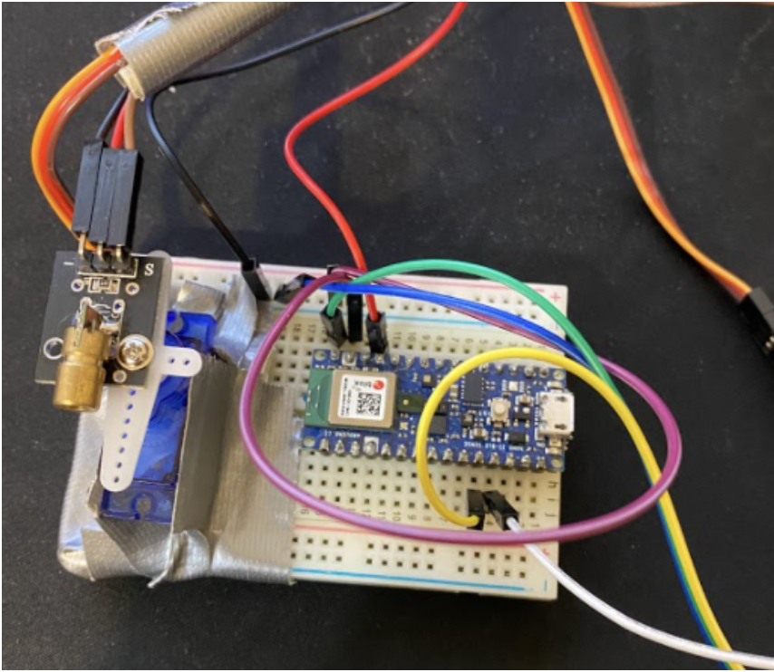

# Table of Contents
* Abstract
* [Introduction](#1-introduction)
* [Related Work](#2-related-work)
* [Technical Approach](#3-technical-approach)
* [Evaluation and Results](#4-evaluation-and-results)
* [Discussion and Conclusions](#5-discussion-and-conclusions)
* [References](#6-references)

# Abstract

For our project, we strive to replicate the game Red Light, Green Light as shown in episode 1 of Squid Game. In order to measure our success, we evaluate our final system in how well the various aspects of the game can be implemented. This includes person detection/tracking, movement detection, formulation of the game system, laser shooting, and etc. We use existing work like DeepSORT and YOLOv4 as the foundation of our algorithm to accomplish real time processing during tracking and detection of players. We implement movement detection through various methods and account for complicated cases in order to make the system more robust. We also integrate this work with a camera system and a laser system, and have a main source where each component is controlled accordingly. Furthermore, we create the Red Light, Green Light game system through a Finite State Machine and incorporate additional features to make the user experience more niche. Results are promising as the system correctly performed as expected when the game was played with multiple players. However, it has necessary improvements such as better detection algorithms that allow the game to be more accurate and fair to the users. We see this project as a possible foundation work that can be built on to create improved versions of Red Light, Green Light, and offer players a better experience.

# 1. Introduction

Our goal for this project was to create a simple version of the game Red Light, Green Light from Squid Game. The main objective of this game is to cross a finish line within a time limit, but players can only move during the green light state. In the show, the doll operating the game uses a high quality camera to identify players that have moved during red lights and shoot them within the same round. For our project we used a Raspberry Pi Zero W camera system to detect players and an Arduino Nano BLE 33 laser system for player elimination.

The version of the game that is the show does not actually exist as a machine currently. However it is possible to create a physical replication of this system with the proper hardware and existing algorithms for person and movement detection. There are many high quality cameras currently available and current defense technology allows for precise target location. Unfortunately, we did not have access to these resources so we opted for our simplified approach using the hardware available to us. 

We implemented a novel method of server-based simultaneous multi-agent detection and tracking in real time. Using a single front-facing camera looking towards the players, we developed a concurrent player tracking system to eliminate players and determine the game winners. Our tracking algorithms also handled occluded players. We made it easier to synchronize and coordinate the different components of the game by centralizing the computation on the server and simply operating the peripheral devices in response.

While our final product is still quite rudimentary in comparison to the version in the show, it shows that there is potential to create an even more advanced version in the future with better equipment. Future versions could build upon the algorithms and methods used in this project to work towards even greater detection accuracy. More generally, this project serves as a fun game to play with friends and family. Our compact version of the game also allows for it to be played in smaller groups than the original version.

This project involved many challenging components. A key challenge was implementing accurate person detection/tracking work even with occlusion to avoid mistracking. Distinguishing the players and pointing the laser at the correct person was also difficult when many people overlapped. Another challenge was streaming the video from the camera to the server for processing in real time. Network latency, system limitations, and discrete computations can also introduce error due to gaps between frames being processed leading to undetected movement.

Our primary goals for this project consisted of the following. We wanted to accurately identify players and distinguish them from one another even when occlusion occurs. We wanted to identify when players overlap so that they couldn’t avoid elimination by hiding behind someone else. We wanted to detect if a player has moved at all during a red light, locate them, and aim the laser at them to eliminate them without hitting other players. 

In order to assess our success in meeting these objectives, we first ensured that we were able to maintain multiple bounding boxes throughout the red light periods and that the bounding boxes were preserved even when people overlap. For player elimination, we assessed how long it took for the laser to fire after a player had moved during a red light and how far off the laser was from its target.

# 2. Related Work

Since our project was based on a game appearing in the show “Squid Game”, it is an integration of several different technologies spanning from person detection and tracking to motion detection to realtime execution. The novelty of our project is in the implementation of individual components and realtime integration, specifically the person detection and tracking.

Many popular object detection projects use R-CNN (Region based Convolutional Neural Networks), which uses a selective search based method to define regions of interest (ROIs), and then separately feed the regions through a collection of support vector machine (SVM) classifiers to classify the objects into defined categories. Although this algorithm provides good results, there are two main downsides. First, the algorithm is very slow since it identifies 2000 candidate regions and classifies all of them, having a model latency on the order of minutes. Second, the selective search algorithm to identify region proposals is fixed, meaning that when the R-CNN model is trained then there is no learning happening at this stage. This means that poor candidate regions can be selected.

Faster versions of R-CNN have been published, such as Fast R-CNN (single pass through the neural network for each image) and Faster R-CNN (ROI extraction happens within the neural network and has realtime speeds), but a more modern algorithm called YOLO (You Only Look Once) has vastly improved prediction latency and throughput. YOLO is able to detect and classify objects in one pass with higher accuracy than R-CNN. This is done by dividing the image into a grid, and for each grid cell the bounding box offset and class probability is predicted. Thresholds and an IoU (Intersection over Union) technique is used to filter out bounding boxes that don’t meet the requirements (i.e. class prediction probabilities, bounding box size, etc.), and runs at over 45 FPS. An improved version of YOLO was used in our implementation of person detection for this project.

Classical object tracking methods are not machine learning based, and instead rely on probabilistic association of object regions between frames. This is called Meanshift or Mode, and by extracting features for the regions in our current frame (i.e. color histogram, texture, keypoint descriptors, etc.), we can associate those features based on the mode of the distribution of those features in the previous frame. These associations will generate a track for an object between successive frames. Another method is called optical flow, which tracks objects using variations in pixel brightness. This spatio-temporal method allows us to determine displacement vectors between frames, but suffers from a challenge that the Meanshift method also has, which is the lack of the ability to handle occlusion. These algorithms define correspondence between successive states in frames, but once the object is no longer detected, it will be identified as a completely new object when it re-appears. These challenges were addressed in our approach for this project. 

# 3. Technical Approach

### 3.a. Game Logic
The game presents itself as a finite state machine. It has a total of 6 states it uses: CONNECTING, GAME_START, GREEN_LIGHT, RED_LIGHT, GAME_END, SHOW_RESULT. The game also consists of a total duration as well as specific state timers that determine how long each green light or red light will be run for. It tracks each player and who’s out throughout the whole game as well. The game also does require some human involvement. Other than setting duration times or thresholds, the players also need to set a start line as well as a finish line physically. They also need to be honest throughout the game for the system to correctly function, as in leaving the camera view only when the player is determined to be out or they’ve crossed the finish line.

The game first starts in the state CONNECTING where it begins reading in feed from the camera source, then it moves onto the state GAME_START. This state can be seen as a preparation stage for every player to come into the view of the camera and be behind the starting line. There’s a 10 second countdown for this state and when the time is up, it moves to the GREEN_LIGHT state.

During GREEN_LIGHT, players will be tracked but they’re free to move as desired. There will be a voice speaking the same line the doll says in the show. However, the voice is slowed down or sped up to match the green light state duration. It functions as an indicator to the users how much time is left until it will be red light again. During RED_LIGHT, the game determines each player’s movement. If a player moves and they’re considered out, their bounding box will disappear and the laser will point at them. This is a cue for the player to exit the camera’s view. For both stages, a colored border, respective to the light of the state, is placed in the camera feed to indicate which state it is.

As mentioned, for each GREEN_LIGHT and RED_LIGHT state, there exists a random timer. When the timer runs out, the state will move from one to the other. Eventually once the game goes past the total duration, the system will then move to the GAME_END state. In this state, it will declare all players that it detects in the camera view to be out because they failed to cross the finish line by the end of the game time, and thus the laser will point at the losers. After, it moves to the SHOW_RESULT state where it prints all winners and losers of the game.

Figure 1. Finite State Machine of game system.

### 3.b. Player Detection
The YOLOv4 model was used for person detection using the COCO dataset. YOLO (You Only Look Once) is a state-of-the-art machine learning algorithm that uses deep convolutional neural networks for object detection and identification. An alternative model, called YOLOv4-tiny, is designed for faster model predictions and requires less compute resources. Although the detection accuracy drops slightly, we are able to achieve real time speeds for person detection to be used in the player tracking.

The YOLOv4 model is especially useful for our project since it is a one-stage object detection model, meaning with a single pass through the neural network the model is capable of detecting regions of the image where objects are present along with classifying them. In our case, we only extract regions where people are detected. We utilized a pre-trained YOLOv4 model implemented in PyTorch and trained on the COCO dataset, which is capable of classifying objects into 80 categories, one of which being a person.

### 3.c. Player Tracking
Once all the players in the scene are identified, we must tag and track each player to determine who wins, loses, and to maintain the overall game state. This task is called person re-identification, meaning we must re-identify players between frames and across many frames if there is any occlusion. To do this, we utilized the DeepSORT (Deep Simple Online Realtime Tracking) algorithm which assigns a deep feature descriptor to each player and uses cosine similarity to tag and track players across frames. 

Many challenges arise when performing object tracking such as occlusion and changes in the object. Occlusion is when an object gets hidden in the frame by another object, but may reappear in a later frame. The object must be re-tagged with the same ID as it was before it was occluded, which previous methods were incapable of. Also, the DeepSORT algorithm is invariant to minor changes in the object, such as object pose and brightness. These changes are not sudden, and since we are computing deep appearance descriptors for each frame the changes get handled appropriately.

### 3.d. Motion Detection
Motion detection presents challenges and tradeoffs for our game system in how strictly it determines movement from a player. Due to imperfections of player detection and tracking, the movement has to be sensed with certain thresholds and aspects that go in parallel with the tracking algorithms. Thus, it uses the person detection’s bounding boxes that are put on each detected player to look at movement.

The system determines a player’s movement with two different methods. First, it observes the change in the player’s centroid, or center of the player’s bounding box. Seeing if the centroid moves more than a certain amount helps track if the person is moving locations in the game field. Second, it observes the length changes of the bounding box’s width and height. Because the bounding box is meant to surround your whole body, including arms and head regardless of pose, looking at bounding box shape changes allows the algorithm to determine if the player is changing poses. Through the two methods, the system correctly detects each player’s movement. A third method that was attempted was looking at the difference of frames. The purpose of this was to detect movement for cases where changing pose may not change the bounding box. However, this could not be reliably implemented as correctly measuring the difference required integration of various other methods, and overlapping of players caused more problems.

Motion detection also handles subtle cases that make the detection algorithm more robust. One, the thresholds used to determine movement are correctly scaled based on the distance of each player. This allows more leniency in value change for players that are close and more strictness for players that are far. The algorithm also handles overlapping of players. Because the player tracking algorithm allows for handling of occlusion, the algorithm was set to handle movement detection of players who overlap. It relaxes the thresholds by a factor for overlapped players so that one person’s movement does not impact the other.

### 3.e. Laser System
To mimic shooting of the players as seen in the show, the system utilizes a laser system to point to players who are out. The laser system is set up through an Arduino Nano 33 BLE Sense that controls a servo motor as well as the laser placed on top of the motor. This arduino is controlled through python on the main system, where it is sent a value in bytes that represents the angle of the player relative to the camera. With the angle, the turned on laser points at each player that is out.

The angle of each player is calculated in a simple manner. The servo motor takes in values from 0 to 180, so the value of 90 was set as the angle the camera is facing, which represents the center of the camera feed. Due to the limitations of the camera, the field of view is much less than 180 degrees and thus has to be calibrated. For our system, the edge of the feed was seen to be about 20 degrees from the center. The field of view for the camera used then was 40 degrees. With this value, the system calculates the ratio of the player’s x-axis center to the total x-axis or pixel length of the camera. It can then find the relative angle of the center of the player from the camera.

Figure 2. Laser system with Arduino Nano 33 BLE Sense with servo motor and laser.

### 3.f. Camera System
We connected our camera to a Raspberry Pi Zero W. We wanted to send video from this camera to the main computer over Wifi. Since we wanted to process these images in real time, we experimented with several different network protocols to achieve the lowest latency. TCP produced the most lag since it ensures that all packets are received. We observed the best performance with UDP streaming using gstreamer but there was still a bit of lag at times. 

Figure 3: Raspberry Pi Zero W with attached camera

The camera was placed at the center line of our playing field in line with the laser system. In order to play our game, we first started sending the stream on the Raspberry Pi. In our main program, we were able to receive this stream as the video source using opencv. The received images were then processed using our person detection and tracking algorithms.
The camera that we used produced images with a bit of distortion and the occasional lag also introduced a bit of error. In order to account for this, we had to experiment with thresholds that would avoid false elimination but still be precise enough to detect motion. 

# 4. Evaluation and Results

We set up the overall system as shown in Figure 4 below. The camera and laser are both connected to the laptop where the camera provides the video, and the laser is controlled through the program in python. Moreover, the laser and camera are aligned to be more accurate in the “shooting” aspect. The feed and the results also show up on the computer for us to record and present to the audience. Lastly, some calibration had to be done through adjusting thresholds in order to account for different resolutions and field of view.

Figure 4. Overall setup with main, camera, and laser systems.
	
To test out our project, we want to measure success for each system. We first tested out our entire system and played the game. The game feed can be seen in the following demo video. 

<svg aria-hidden="true" viewBox="0 0 16 16" version="1.1" data-view-component="true" height="16" width="16" class="octicon octicon-device-camera-video">
<path fill-rule="evenodd" d="..."></path>
</svg>
Final Demo Video with Pi Camera

<iframe src="https://drive.google.com/file/d/1BPUF_jrIdmWA7rql7Ji6l_i6wpx8PQOt/preview" width="640" height="480" allow="autoplay"></iframe>
  

The results are promising since it successfully detects players, detects movement, and declares the correct winners and losers. However, it’s evident that the camera is very poor quality. The resolution and the lighting unstabilize the person detection, and thus the tracking and movement detection as well. Even though the algorithm works, it’s not ideal nor robust to be used in various settings. Furthermore, because the pi was connected through wifi, there was a noticeable latency in the feed compared to real life. This delay would cause some confusion to players due to the timing offset between the feed and the rest of the system. Therefore, for the rest of the testing, we decided to use the computer webcam which provides a significantly improved feed. We believed this was more beneficial since we needed to test out our algorithms more so than if the camera was working, which we already confirmed it did.

With the computer camera, we then played the game again, as seen in the following demo video. 

<svg aria-hidden="true" viewBox="0 0 16 16" version="1.1" data-view-component="true" height="16" width="16" class="octicon octicon-device-camera-video">
<path fill-rule="evenodd" d="..."></path>
</svg>
Final Demo Video with Webcam

<iframe src="https://drive.google.com/file/d/1peshBYv475qRYQOeW8WWst6J2ZbvCDQx/preview" width="640" height="480" allow="autoplay"></iframe>
  

The game is able to correctly sense movement and declare player 3 out. It also declares player 2 out for being seen in the camera by the end of the game. Then it correctly states player 1 won as she crossed the finish line and left the view. It completed all states in an expected manner. The below video is a run testing for overlap and occlusion. 

<svg aria-hidden="true" viewBox="0 0 16 16" version="1.1" data-view-component="true" height="16" width="16" class="octicon octicon-device-camera-video">
<path fill-rule="evenodd" d="..."></path>
</svg>
Overlap Demo Video

<iframe src="https://drive.google.com/file/d/14v7Cakkbt08IaHfC-_vuKKec-dq7woLc/preview" width="640" height="480" allow="autoplay"></iframe>
  

The algorithm correctly determines the moving player to be out while still keeping the other player in the game, even though a player walks across. Thus the system handles various cases of detection correctly. The final video below shows the laser system correctly pointing at a person who moves during a red light and is now out. 

<svg aria-hidden="true" viewBox="0 0 16 16" version="1.1" data-view-component="true" height="16" width="16" class="octicon octicon-device-camera-video">
<path fill-rule="evenodd" d="..."></path>
</svg>
Laser Demo Video

<iframe src="https://drive.google.com/file/d/12A3V_vAadb4cOhCGmkEsvoJqGtSqhAFP/preview" width="640" height="480" allow="autoplay"></iframe>
  

Overall, it displays all important qualities of red light, green light as seen in the show. The laser system and the algorithms implemented to replicate aspects of the game all function as desired.

# 5. Discussion and Conclusions
The results show that our simplified replica of Red Light, Green Light functions well enough to correctly perform all desired qualities of the game that we believed were important. Through improving on existing algorithms and knowing our goals, the direction to head in was clear and we were able to create a game that can actually be played. We use this section to discuss some steps we wanted to try, and also suggest future directions for this project.

As mentioned previously in the results section, the stream from a pi camera setup caused problems due to latency and resolution quality. However, the overall system would function with no issues if the internet speed is high and the camera is improved. The algorithms are robust enough to function with various systems, and thus revamping the hardware is certainly a next step in creating a better game. Hardware enhancements are also required in the laser system. The servo motor and laser did the job, but the motor control was unstable and the laser was very weak. Simply using better components will be a good progress. 

Another noteworthy improvement lies in the motion detection. Because DeepSORT and YOLOv4 are set to handle real time processing, the two algorithm’s precision is not as accurate as it can be. Moreover, since motion detection depends on these two algorithms, it is heavily affected by how well they perform. A step then is to find better algorithms for detection and tracking that allows for higher accuracy in motion detection. The motion detection methods can also be improved as well. A direction would be to reimplement and refine the difference of frames. This returns a much more strict but correct motion detection that can even observe one limb movement or head movement. Furthermore, it’s important to better handle cases of occlusion and overlapping as well. There are many factors that go into understanding movement when these cases happen, so both aspects need much more research to perfect. 

Lastly, an improvement to even the actual game system from the show would be to detect movement of players hidden behind others. Our system utilizes just one camera, just like the doll, and thus it cannot track players that stay behind someone. To truly make Red Light, Green Light fair, any motion has to be detected. Therefore, using multiple cameras set up at various angles to detect motion could be an improvement that makes the game even more strict. The algorithm would have to correctly match the detected player from all angles, but it’s a step that enhances the game. Our system is still a simple replica, but it shows potential to be a source for better versions that may even be better than the one from Squid Game.

# 6. References
Gandhi, R. (2018, July 09). R-CNN, Fast R-CNN, Faster R-CNN, YOLO - Object Detection Algorithms. Retrieved from https://towardsdatascience.com/r-cnn-fast-r-cnn-faster-r-cnn-yolo-object-detection-algorithms-36d53571365e

Bochkovskiy, A., Wang, C., & Liao, H.M. (2020). YOLOv4: Optimal Speed and Accuracy of Object Detection. ArXiv, abs/2004.10934. https://arxiv.org/abs/2004.10934

https://github.com/AlexeyAB/darknet
https://github.com/pjreddie/darknet

Jiang, Z., Zhao, L., Li, S., & Jia, Y. (2020). Real-time object detection method based on improved YOLOv4-tiny. ArXiv, abs/2011.04244. https://arxiv.org/abs/2011.04244

Wojke, N., Bewley, A., & Paulus, D. (2017). Simple online and realtime tracking with a deep association metric. 2017 IEEE International Conference on Image Processing (ICIP), 3645-3649. https://arxiv.org/abs/1703.07402

https://github.com/nwojke/deep_sort

Milan, A., Leal-Taixé, L., Reid, I., Roth, S. & Schindler, K. MOT16: A Benchmark for Multi-Object Tracking. arXiv:1603.00831 [cs], 2016., (arXiv: 1603.00831). https://arxiv.org/abs/1603.00831
